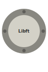
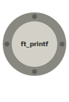
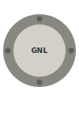
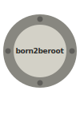
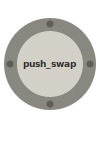
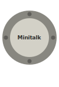
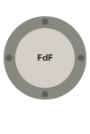
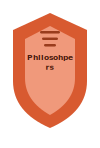
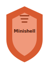

### C/C++ Systems Engineer • Software Engineer (full-stack) • 42 Lisboa

I build low-level systems in C/C++ and full-stack web applications with focus on performance, architecture, and reliability.

### Background

<ul style="padding-left: 16px; margin-left: 0;">
  <li>Built Unix-level C/C++ systems</li>
  <li>Software Engineer at early-stage startup</li>
  <li>Improved team operational efficiency</li>
</ul>

### Tech Stack

**Systems:** C, C++, Linux, Unix, POSIX  
**Concurrency:** threads, processes, IPC  
**Backend:** Node.js, NestJS, REST APIs  
**Frontend:** Next.js, React, TypeScript  
**Data:** SQL, MongoDB  
**Tools:** Git, Docker, gdb, valgrind

<!--

  <a href="#c-cpp" style="
    display:inline-block;
    padding:8px 14px;
    margin:4px;
    border:1px solid #444;
    border-radius:8px;
    text-decoration:none;
    font-weight:600;
  ">
  C/C++ Systems
  </a>
  <a href="#web-dev" style="
    display:inline-block;
    padding:8px 14px;
    margin:4px;
    border:1px solid #444;
    border-radius:8px;
    text-decoration:none;
    font-weight:600;
  ">
  Web Dev
  </a>

 -->

<!-- 42 Projects -->

C/C++ Systems Projects

  

  
  
  

  
  
  

  
  

<!-- 

<b>Web Dev</b>

  

  
  

 -->
